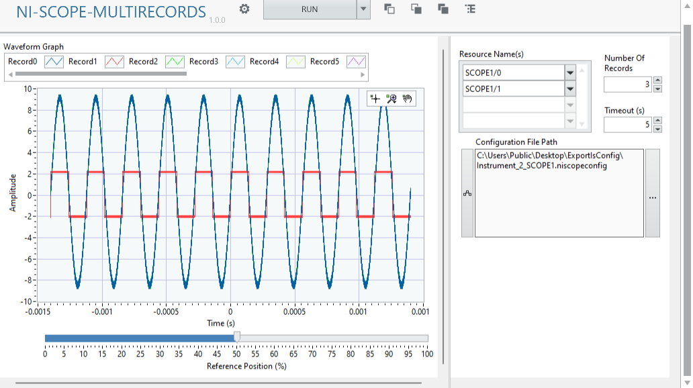

# NI Scope Multirecords Plugin
## Overview
NI Scope Multi-Records Panel allows you to record multiple waveforms based on the trigger setting in the NI-Scope Configuration file.
Only support single instrument session (allow multiple channels, but all must be within one single instrument).

## Tips
First, use the normal NI Scope front panel to adjust the desired scope settings and export as .niscopeconfig file (Gear >> Export >> Driver Configuration).

Then, use the NI Scope Multi-Records Panel to load the configuration file. Set the desired **Number of Records** to repeat the acquisition. Adjust the **Reference Position (%)** and **Crop (%)**,  to overwrite the original settings. 

The **Reference Position** will adjust the proportion of pre-trigger and post-trigger samples in each record. 

The **Crop** will reduce the waveform duration in the ratio against original waveform duration. That means 100% = No waveform cropping. 

Use the right click >> Export feature of LabVIEW graph to export records into other formats:

## Software Dependencies
- InstrumentStudio Pro (2025 Q4 or higher)
- NI-SCOPE (2025 Q4 or higher)
- LabVIEW (2025 Q3 or higher)