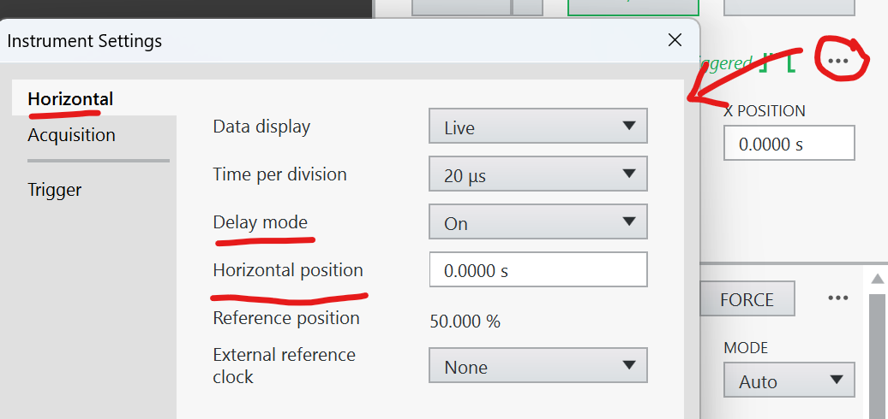
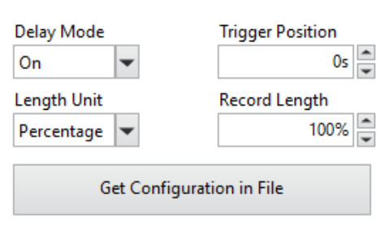

# NI Scope Multirecords Plugin

## Overview

NI Scope Multi-Records Panel allows you to record multiple waveforms based on the trigger setting in the NI-Scope Configuration file.
Only support single instrument session (allow multiple channels, but all must be within one single instrument).

## How To Use

### Basic Configuration

First, use the normal NI Scope front panel to adjust the desired scope settings and export as .niscopeconfig file (Gear >> Export >> Driver Configuration).

Then, use the NI Scope Multi-Records Panel to load the configuration file (**Configuration File Path**). Set the desired **Number of Records** to repeat the acquisition. Adjust the **Horizontal Position** and **Record Length**,  to overwrite the original settings.

### Change Configuration of **Horizontal Position** and **Record Length**

When **Delay Mode** On, the **Horizontal Position** will be in seconds to configure the Trigger Delay. When **Delay Mode** Off, the **Horizontal Position** will be in percentage to confiugre the Reference Position - proportion of pre-trigger samples vs post-trigger samples. To find these settings on NI Scope native soft front panel, click the **...** button >> **Horizontal**. By default, the **Delay Mode** is On. 

The unit of **Record Length** can be either percentage or seconds. When **Length Unit** is Percentage, 100% is the original record length. When **Length Unit** is seconds, you can set to any positive value for exact length in time, or set to zero or less to use the original record length.

You can also read the **Horizontal Position** and **Record Length** settings from the configuration file. Click the **Get Configuration in File** button to reset the settings on the panel. 

### Export Displayed Data or Stream Records to File

A quick way to export records shown on the graph is by right clicking it >> **Export** feature of LabVIEW graph to export records into other formats:

However, the graph on the panel will  **only display the latest 10 records of all channels**. To ensure all the records are saved, specify the **Stream To File Path** to a new or existing TDMS file.

Following shows an example of the TDMS group and channel names after save records into file:

## Software Dependencies

- InstrumentStudio Pro (2025 Q4 or higher)
- NI-SCOPE (2025 Q4 or higher)
- LabVIEW (2025 Q3 or higher)
- [JSONtext by JDP Science](https://www.vipm.io/package/jdp_science_jsontext/) - a VI Package from JKI VIPM

